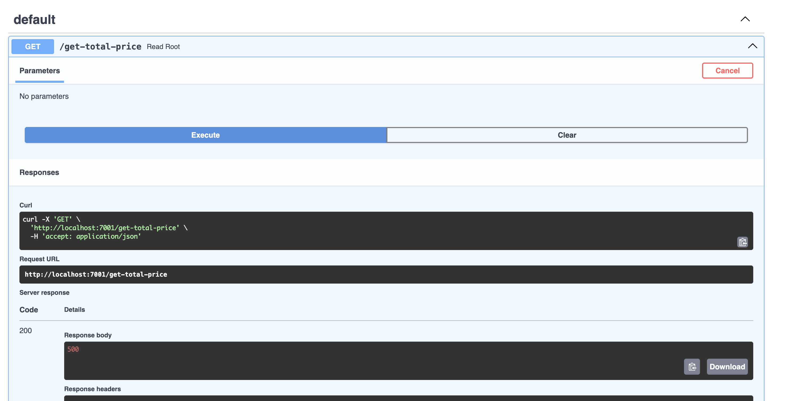
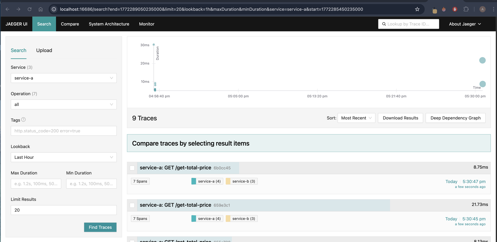
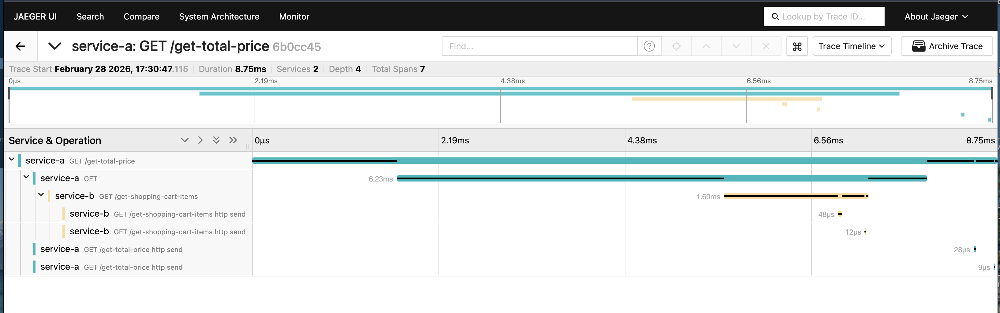

Для удобства запустил все через docker-compose, надеюсь это не критично для задания.

# Запуск

Переходим в директорию `app`.

Собираем все сервисы: `docker-compose build`

Запускаем в фоне: `docker-compose up -d`

# Запущенные сервисы

Jaeger UI: http://localhost:16686

service-a: http://localhost:7001/docs

service-b: http://localhost:7002/docs

# Проверка

Сервис service-a косвенно вызывает service-b. Делаем запрос через swagger:

Далее переходим в jaeger и находим этот вызов.

В детализации видно, что внутри service-a делает вызов к service-b и все корректно фиксируется в jaeger:

