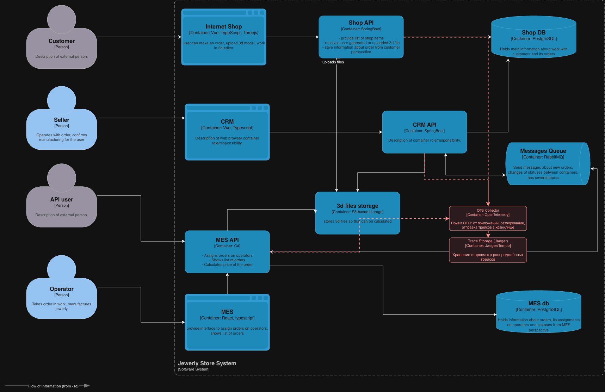

# Архитектурное решение по трейсингу

Нужно в любой момент отвечать на два вопроса: что происходило с заказом и где он сейчас. Сейчас после "Сделать заказ" заказ уходит в MES через API или RabbitMQ, и без логов путь не восстановить. Добавляем трейсинг по цепочке заказа и статусам.

## Системы и точки отказа (что покрыть трейсингом)

По C4 и потокам данных наметили места, где заказ может сломаться или зависнуть:

| Система | Риски |
|--------|--------|
| **Shop API** (Spring Boot) | Создание заказа, загрузка 3D в S3, отправка в MES. Таймауты при записи в S3, дубли при повторной отправке, ошибки валидации. |
| **CRM API** (Spring Boot) | Подтверждение заказа (MANUFACTURING_APPROVED), закрытие (CLOSED). Блокировки в БД, зависание в ожидании очереди. |
| **RabbitMQ** | Обмен статусами CRM и MES. Сообщение не доставлено, ушло в DLX, потеря заголовков (в т.ч. trace_id), задержка из-за длины очереди. |
| **MES API** | Расчёт стоимости (2-30 мин), смена статусов, дашборд оператора. Долгий расчёт, гонка за заказы, тяжёлые запросы списка (медленная первая страница). |
| **Shop DB, MES DB** | Запись и чтение заказов и статусов. Медленные запросы, таймауты, обрывы соединений. |
| **S3 (3d files storage)** | Загрузка и чтение 3D-моделей. Таймауты, падения на больших файлах. |

На схеме новые компоненты трейсинга и связи с ними выделены красным.

## Данные для трейсинга

1. **В каждом спане обязательно:** trace_id, span_id, parent_span_id, имя операции, начало и конец.

2. **Отдельно вешаем на спан:** order_id, channel (web или partner), по возможности partner_id, status_from, status_to, тип продукта (готовое/кастом).

3. **Техническое:** service.name, env, http.method, http.route, http.status_code; для БД - тип операции (без полного SQL); для RabbitMQ - messaging.system=rabbitmq, messaging.destination (очередь), при необходимости message_id.

4. **Как склеиваем трейс:** один trace_id на цепочку. Передаём его в HTTP-заголовках (X-Trace-ID или traceparent) и в заголовках сообщений RabbitMQ, чтобы спаны из Shop API, CRM, MES API и очередей попадали в один трейс.

5. **Что выносим в отдельные спаны:** создание и отправка заказа (Shop API), загрузка 3D в S3, расчёт стоимости (MES), каждый переход статуса заказа (status_from, status_to), публикация и чтение сообщения из RabbitMQ.

6. **Внутри спана при необходимости:** ретрай, таймаут, попадание в DLX, взятие заказа оператором - помечаем как события с коротким текстом.

## Мотивация

**Зачем это нужно:**

- Быстрее разбирать инциденты: видно, на каком шаге заказ застрял (расчёт, очередь, CRM, БД), а не где-то в системе.
- Можно нормально ответить партнёрам и клиентам: показать этап и причину задержки (долгий расчёт в MES или очередь в RabbitMQ).
- Потом по трейсам можно повесить алерты вида "заказ не перешёл в следующий статус за N времени".
- По длительности спанов видно, что оптимизировать в первую очередь (дашборд MES, расчёт цены, запросы к БД).

**Что хотим улучшить по цифрам:**

| Метрика | Тип | Ожидание |
|--------|-----|----------|
| MTTR по инцидентам "заказ не пришёл / завис" | Техн. | Снижение на 30-50%, так как быстрее понимаем, где застряло. |
| Доля заказов с просрочкой по этапу (напр. SUBMITTED - PRICE_CALCULATED) | Бизнес | Снижение за счёт точечных доработок. |
| Жалобы партнёров и отток B2B | Бизнес | Меньше при росте прозрачности и соблюдении SLA. |
| Ретраи и сообщения в DLX | Техн. | Видно причину (таймаут, ошибка), можно снижать осознанно. |
| Время загрузки первой страницы MES (p75/p95) | Тех/UX | Видно, какие запросы тормозят, и их резать. |

## Предлагаемое решение

**Стек:** OpenTelemetry (SDK для Java и .NET), OTel Collector, хранилище трейсов (Jaeger или Tempo). Смотреть в UI Jaeger или в дашбордах Grafana.

**Что ставим:**

1. **В приложениях (Shop API, CRM API, MES API)** подключаем OTel SDK: автотрейсинг HTTP и обращений к БД, ручные спаны для "создание заказа", "расчёт стоимости", "переход статуса". В HTTP и в сообщения RabbitMQ добавляем передачу контекста (trace_id, span_id).
2. **OTel Collector** - отдельный сервис: приём OTLP от приложений, батчи, при желании режем чувствительные поля. Шлёт трейсы в хранилище.
3. **Trace Storage** - Jaeger или Grafana Tempo, храним трейсы 7-14 дней для разбора и отладки.
4. **Связи:** Shop API, CRM API и MES API шлют трейсы в OTel Collector, Collector отдаёт в Trace Storage. Схема: [С4.drawio](С4.drawio).

**Минимум доработок:**

- Передаём один и тот же trace_id по HTTP (входящий запрос и все вызовы в БД, S3, другие API) и при публикации/чтении из RabbitMQ (в заголовках сообщения).
- Ручные спаны с order_id на ключевых операциях, чтобы в UI искать трейс по номеру заказа.

## Компромиссы

- **Насколько глубоко лезть в MES.** Расчёт стоимости там может быть проприетарным или сложным. Пока хватает одного спана "расчёт стоимости". Дробить по шагам внутри расчёта можно потом.
- **order_id в метриках не держим** - только в атрибутах спанов и в поиске по трейсам, иначе в Prometheus раздует кардинальность.
- **Срок хранения** - 7-14 дней в основном хранилище; для разбора при необходимости выгружаем в файл или в долгий архив. Дольше - по объёму и деньгам.
- **Семплирование.** При росте нагрузки включаем (например 10-20% запросов), для ошибок и медленных - долю поднимаем, чтобы картина оставалась адекватной без перегрузки хранилища.
- **RabbitMQ** сам по себе не шлёт трейсы - их шлют приложения при публикации и чтении. Связь "сообщение - запрос" за счёт trace_id в заголовках.

## Безопасность

- **Доступ к UI трейсов (Jaeger/Grafana)** - только свои. Вход через корпоративный SSO или внутренний IdP. Роли: смотреть трейсы - разработчики и поддержка; администрировать хранилище и коллектор - DevOps или архитектор.
- **Сеть.** OTel Collector и Trace Storage только из своей сети/VPC, наружу не отдаём. Партнёры по API к системе трейсинга доступа не имеют.
- **В трейсах** не кладём персональные данные (ФИО, адрес, телефон). При необходимости режем в Collector (маскируем или убираем поля). order_id и тех. идентификаторы для разбора ок.
- **Аудит:** логируем вход в UI и чувствительные действия (экспорт трейсов, смена конфига), потом при необходимости смотрим.
