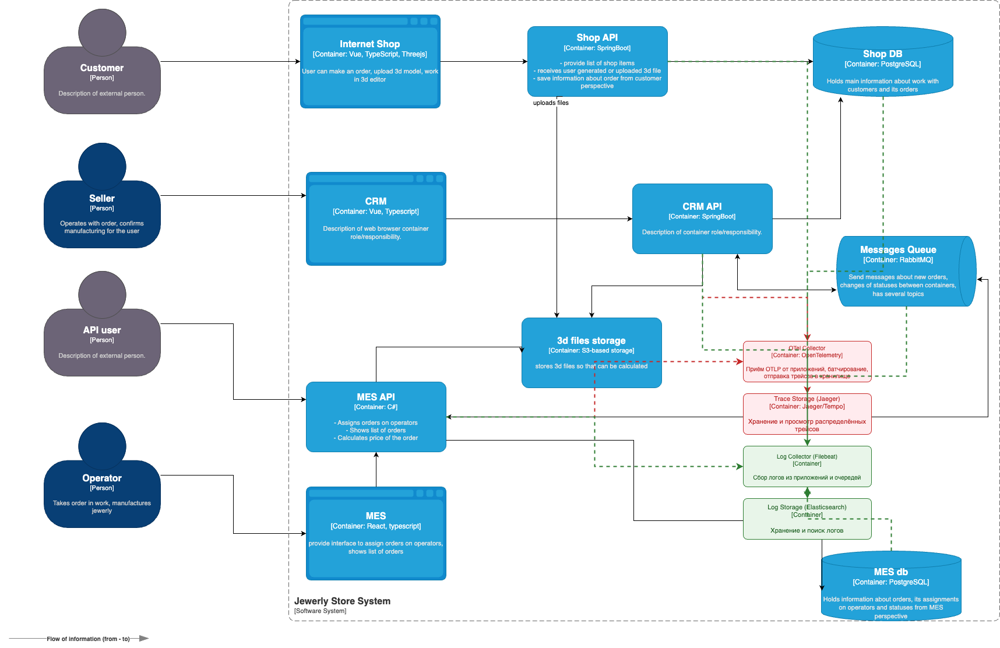

# Архитектурное решение по логированию

## Контекст

Сейчас при сбоях или странном поведении мы опираемся на то, что рассказывает клиент. Чтобы понять, что произошло на стороне сервиса, уходит много времени и у разработчиков, и у техподдержки. Нужно системное решение: единое логирование, по которому можно быстро найти причину.

## Источники логов

Сбор логов нужен из таких систем:

1. **Интернет магазин** (фронт) - ошибки в браузере, падения 3D-редактора.
2. **Shop API** (Spring) - заказы, загрузка файлов, обращение к БД и хранилищу, ошибки.
3. **CRM** (фронт) - ошибки интерфейса продавцов.
4. **CRM API** (Spring) - работа с заказами, смена статусов, отправка в очередь, ошибки.
5. **MES API** - расчёт цены, назначение заказов операторам, статусы, ошибки.
6. **MES** (фронт) - ошибки интерфейса операторов.
7. **Messages Queue** (RabbitMQ) - доставка сообщений, очереди, мёртвые письма.
8. **Shop DB** и **MES db** (PostgreSQL) - медленные запросы и ошибки.

### Список логов уровня INFO

Общие поля для всех: время, уровень (level), сервис (service), окружение (env), trace_id, order_id (если есть).

**Shop API:**
- Создание заказа - время, order_id, customer_id, количество позиций, сумма.
- Загрузка 3D-модели - время, order_id, file_id, размер файла, хранилище (S3).
- Изменение статуса заказа - время, order_id, старый и новый статус.

**CRM API:**
- Изменение статуса заказа (подтверждение производства, закрытие) - время, order_id, кто изменил (id оператора), новый статус.
- Отправка сообщения в очередь - время, тип сообщения, order_id, exchange/queue.

**MES API:**
- Расчёт цены заказа - время, order_id, длительность расчёта, результат (успех/ошибка).
- Назначение заказа на оператора - время, order_id, operator_id.
- Изменение статуса производства - время, order_id, старый и новый статус.

**RabbitMQ (со стороны приложений или брокера):**
- Сообщение отправлено/доставлено - очередь, message_id, order_id при наличии.
- Сообщение в мёртвую очередь - очередь, причина, order_id при наличии.

**БД:**
- Медленный запрос - сервис, время выполнения, SQL запрос.

**Фронты (Интернет магазин, CRM, MES):**
- Ошибка на клиенте - страница/экран, тип ошибки, build_id.

## Другие уровни логирования

- **WARN** - нестандартная ситуация: повторная отправка в очередь, приближение к лимиту, отказ кеша, ретраи.
- **ERROR** - операция не удалась или откатилась. Обязательно: код ошибки, тип исключения, trace_id.
- **DEBUG** - детали для отладки. Включать только по флагу или в dev, не держать постоянно в проде из-за объёма.
- **AUDIT** - вход в админку/CRM, смена ролей, доступ к заказу, изменение важных настроек. Нужен для разбора инцидентов и аудита.
- **FATAL** - только при критических сбоях, когда сервис падает или не может работать. Например если один из кмопонетов упал и вообще не работает.

## Мотивация

Без логов каждый сбой разбирается вручную: уточнение информации у клиента, перебор гипотез, долгий поиск. Это съедает время поддержки и разработки и задерживает исправления.

Что даёт внедрение логирования:

1. **Меньше времени на разбор инцидента** - по order_id или trace_id можно быстро увидеть цепочку событий и найти место сбоя.
2. **Снижение нагрузки на поддержку** - первая линия может сама смотреть логи и давать ответ клиенту или передавать уже конкретную причину в разработку.
3. **Меньше "потерянных" заказов** - по логам очередей и статусов видно, где заказ застрял или ушёл в DLQ.
4. **Быстрее релизы** - воспроизведение багов по логам.
5. **Прозрачность по партнёрскому API (если есть)** - видно отказы, квоты, ретраи. Меньше споров и лишнего общения с партнерами.

## В какой очерёдности подключать системы

Сразу всё покрыть не получится. Поэтому стоит начинать с самого важного:

1. **Shop API + CRM API + очередь (RabbitMQ)** - здесь создаются и двигаются заказы. Большинство обращений клиентов именно про "заказ не прошёл" или "статус не обновился". Логи и трейсинг тут дают максимум пользы.
2. **MES API** - расчёт цены и назначение на операторов часто бывают узким местом и источником задержек; по логам проще искать причины.
3. **БД (Shop DB, MES db)** - медленные запросы и ошибки. Подключать после того, как приложения уже пишут структурированные логи с trace_id.
4. **Фронты (Internet Shop, CRM, MES)** - ошибки в браузере. Можно вынести в отдельный этап, например через Sentry или аналог, чтобы не смешивать с бэкенд-логами.

Трейсинг имеет смысл включать там же, где сначала подключаем логи (Shop API, CRM API, MES API), чтобы по одному trace_id видеть путь запроса.

## Предлагаемое решение

**Формат:** структурированные логи (JSON). Связь по trace_id и order_id между сервисами.

**В приложениях:** Spring Boot - стандартный JSON-логгер (Logstash). На фронте - логгер ошибок (Sentry) без передачи персональных данных.

**Сбор:** Filebeat агент на каждом поде, читает stdout или файлы, при необходимости слегка фильтрует и маскирует чувствительные поля, отправляет в общее хранилище.

**Хранилище:**  Elasticsearch.

**Просмотр:** Kibana - дашборды по заказам (жизнь заказа по order_id), по ошибкам API, по очереди (DLQ, ретраи).

## Безопасность логов

- **Чувствительные данные:** не логировать пароли, полные номера карт, полные телефоны и адреса. Телефоны и email - маскировать (часть символов звёздочками). Идентификаторы пользователей - по необходимости хешировать или не выводить в открытом виде в общих логах.
- **Файлы:** не логировать содержимое 3D-файлов и любых загружаемых файлов. Только метаданные (file_id, размер итд).
- **Доступ:** доступ к логам только по ролям: поддержка - ограниченный набор полей (например без внутренних id), разработчики и девопсы - полный доступ для разбора. Аудит-логи - отдельно, доступ по запросу от руководства.
- **Транзит и хранение:** передача в хранилище по защищённому каналу. Хранилище по возможности шифровать.

## Хранение и индексация

- Отдельный индекс (или поток/тег) на систему: shop-api, crm-api, mes-api, rabbitmq, shop-db, mes-db, frontend-errors. Плюс разделение по окружению (prod, stage, dev).
- Сроки: "горячие" данные 7 дней для оперативного разбора, затем 3 месяца в более дешёвом хранилище для расследований. Точные цифры можно скорректировать на основе бюджета.
- Размер: ограничить размер одного сообщения, большие стек-трейсы или payload не хранить целиком, только ссылку на трейс или артефакт.
- Аудит-логи - хранить дольше (например до года) и в отдельном хранилище с ограниченной записью (только добавление).

## От сбора к анализу

**Алертинг:** на основе запросов к логам (или метрикам из логов) настроить правила:
- Резкий рост числа созданных заказов за короткий интервал (возможная атака или сбой на стороне партнёра).
- Рост числа сообщений в мёртвой очереди за 5-10 минут.
- Рост доли ошибок расчёта цены (MES API) за N минут.
- Увеличение числа медленных запросов к БД выше порога.
- В принципе любые 5xx и 4xx ошибки выше порога

**Аномалии:** при желании можно подключить детекцию аномалий& Цель - заметить необычную нагрузку или всплеск ошибок без ручного просмотра.

**Шаблоны:** сохранить готовые запросы: "все события по заказу N", "все ошибки сервиса X за сутки". Это нужно чтобы поддержка и разработка не писали запросы с нуля каждый раз.
