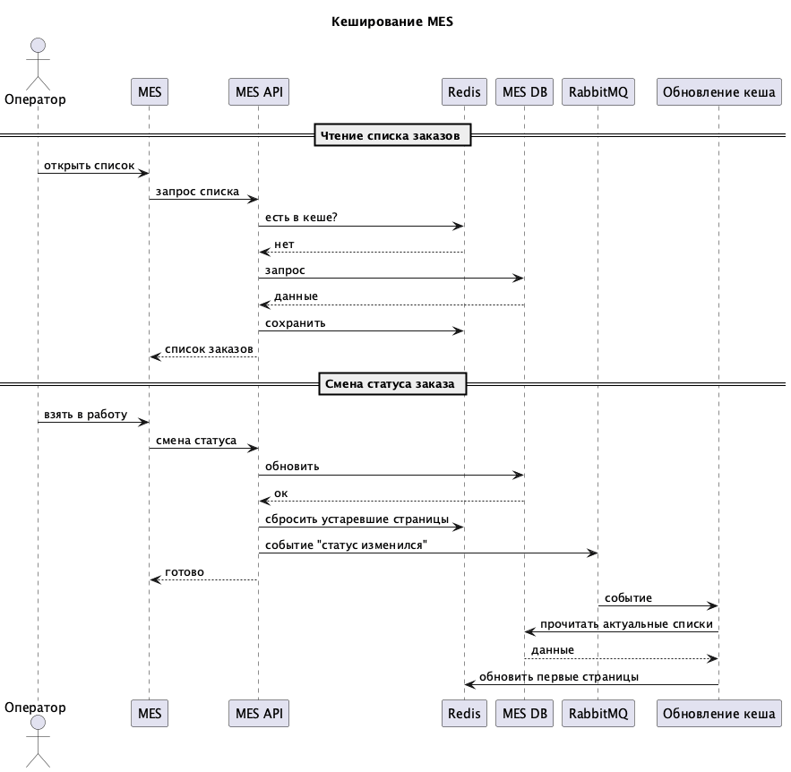

# Архитектурное решение по кешированию

## Контекст

MES работает медленно. Операторам долго грузится список заказов, клиенты жалуются на сроки. Узкое место - запросы к базе при каждом открытии дашборда и при взятии заказа в работу. Нужно разгрузить БД и ускорить отдачу списков.

## Что кешировать

- Списки заказов по статусам с пагинацией. Чтобы не дергать БД при каждом обновлении страницы. Важно, чтобы данные не устаревали - иначе два оператора могут взять один заказ.
- Результаты расчёта цены по модели. Одинаковые конфигурации считаются часто, смысла гонять расчёт каждый раз нет.
- Если есть партнёрский API с идемпотентностью - храним ключи запросов с коротким TTL, чтобы не обрабатывать дубли.

Персональные данные и сами 3D-файлы в кеш не кладём. Статику можно хранить в CDN отдельно.

## Мотивация

Операторам нужен быстрый отклик. Делаем список из кэш памяти, а не из БД. База разгружается - самые частые запросы (первая страница по статусу) обслуживает Redis. Расчёт цены не повторяем для одной и той же модели. И при смене статуса кеш сбрасываем и подтягиваем свежее. Все видят актуальную картину, меньше конфликтов "кто первый нажал".

Участвуют MES API, Redis и потребитель очереди (по событию смены статуса обновляет кеш).

## Предлагаемое решение

### Серверный кеш

Делаем кеш на сервере (Redis). Клиентский кеш для дашборда не подходит - там нужны быстрые обновления и общая картина для всех операторов, а они работают из рахных браузеров.

### Как читаем и пишем

**Чтение списков** - паттерн Cache-Aside: сначала смотрим в Redis, если пусто - идём в БД, результат пишем в кеш и отдаём. Жизнь ключа короткая (5-10 сек), чтобы после смены статуса не показывать старый.

**Смена статуса** - Write-Through: обновили заказ в БД, сразу сбрасываем затронутые страницы в кеше и шлём событие в RabbitMQ. Потребитель по событию может подогреть первую страницу для нужных статусов - её открывают чаще всего.

**Расчёт цены** - запоминаем результат по хешу модели и параметрам, храним несколько дней. При смене прайса добавляем версию в ключ.

Refresh-Ahead не берём: непонятно, что именно подогревать заранее. Подогрев по событию "статус изменился" проще и предсказуемее.

### Диаграмма

### Инвалидация

Используем три механизма вместе: сброс по ключу при записи, короткий TTL у страниц, прогрев первой страницы по событию из очереди.

При смене статуса заказа удаляем из кеша страницы по старому и новому статусу. У ключей ставим TTL 10 сек. Потребитель RabbitMQ по событию кладёт в кеш первую страницу для этих статусов, чтобы при следующем запросе не нагружать БД.

### Безопасность и объём

В списках в кеше храним только то, что нужно для отображения (id, статус, даты), без адресов и ФИО. Redis в приватной сети, доступ только с MES API и сервиса обновления кеша. Размер считаем по числу активных заказов и страниц. Несколько гигабайт с вытеснением старых ключей обычно хватает.

### План

1. Поднять Redis, подключить к MES API.
2. При запросе списка заказов используется Cache-Aside (кеш, при промахе БД и запись в кеш).
3. При смене статуса обновить БД, сбросить нужные ключи в Redis, отправить событие в RabbitMQ.
4. Потребитель по событию обновляет первую страницу для затронутых статусов.
5. Кешировать результат расчёта цены по хешу модели.
6. Смотреть метрики (промахи, задержки) и при необходимости править TTL и размер Redis.
